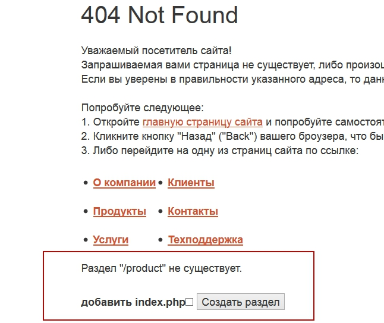

# bitrix-clever-404
Компонент для битрикс, который позволяет создавать несуществующие разделы с 404 страницы.

##Установка

1. Скопировать компонент в папку /local/components/bit/ или /bitrix/components/bit/

2. Добавить на 404 странице такой код подключения
```php
if ($GLOBALS['USER']->IsAdmin()) {
    $APPLICATION->IncludeComponent("bit:clever404", "", Array());
}
```

3. В результате получите
